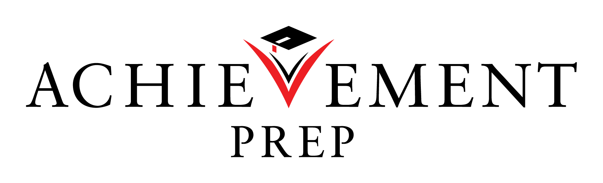
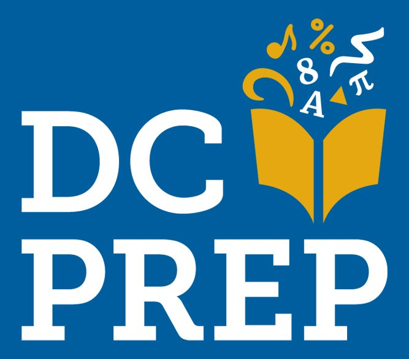
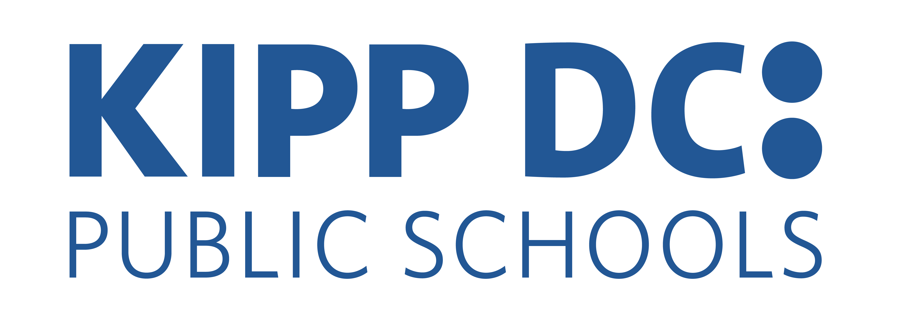
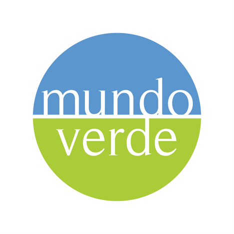
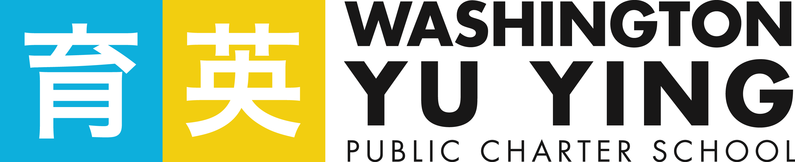
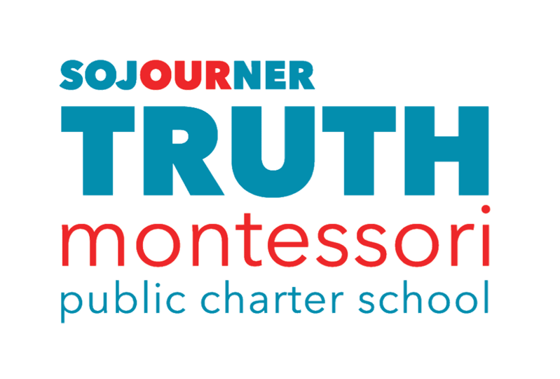

## Who We Are

CitySchools Collaborative (CSC) is a nonprofit organization dedicated to expanding access to high-quality, high-impact tutoring for students who need it most. Based in Washington, DC, CSC works directly with schools and districts to build the planning infrastructure, coaching support, and quality monitoring systems that allow tutoring programs to succeed. CSC is DC's trusted partner in citywide initiatives related to tutoring, talent, and truancy, having served over 100 schools since 2021.

---

## Our Approach

CSC's model goes beyond placing tutors in classrooms. We partner with schools to:

- Align tutoring to the Science of Reading and to classroom instruction
- Build consistent, protected time for tutoring into the school day
- Monitor implementation to catch problems early
- Use data to track progress and inform decision-making

This comprehensive approach is what the IST study is designed to evaluate, and what CSC believes makes high-impact tutoring truly high-impact.

Read more about us at [cityschoolscollab.org](https://cityschoolscollab.org/).

> "The single program that has made the biggest difference in Truth's improved academic outcomes has been High-Impact Tutoring…It has made a critical difference for our students who have been struggling with math through these post-pandemic years."
>
> — Justin Lessek, Executive Director, Sojourner Truth PCS

> "I feel very confident about learning new things with my tutor when I don't understand my work."
>
> — Tutored Student, Middle School

---

## Proven Results

A previous study of CSC's tutoring program found that students who received high-intensity math tutoring from CSC providers in 2023–2025 received the equivalent of an additional 59 instructional days and achieved, on average, 138% of their expected growth on math assessments.

[→ Read the QED Report](https://www.empowerk12.org/research-source/2025-csc-hit-impact-evaluation)

---

## Who CSC Has Served

CSC has worked with over 100 schools since 2020. Below are a few LEAs CSC has worked with in the District of Columbia:

::: {.logo-table}
| | | |
|:---:|:---:|:---:|
| {style="max-height:80px; vertical-align:middle;"} | {style="max-height:80px; vertical-align:middle;"} | {style="max-height:80px; vertical-align:middle;"} |
| {style="max-height:80px; vertical-align:middle;"} | {style="max-height:80px; vertical-align:middle;"} | {style="max-height:80px; vertical-align:middle;"} |
:::

Read more about how CSC has impacted schools in their [annual impact reports](https://cityschoolscollab.org/).
